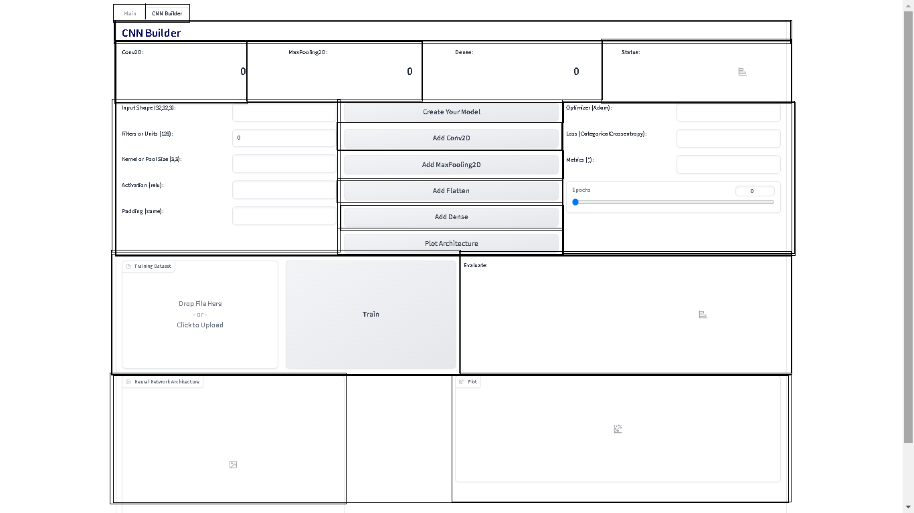

# ML-for-Software-Engineers-Bootcamp-Gradio-Example
Gradio Example for ML for Software Engineers Bootcamp

### ToDo 📖:
  * Create Main App Structure : 🆗
  * Main Variables: 🆗
  * Main Functions: 🆗
  * Gradio Interface: 🆗
  * Training: 🆗

Dataset: https://drive.google.com/file/d/1nNuexpQu-FxOj0sUzZY3_JZ7IcsTwH7i/view?usp=sharing
